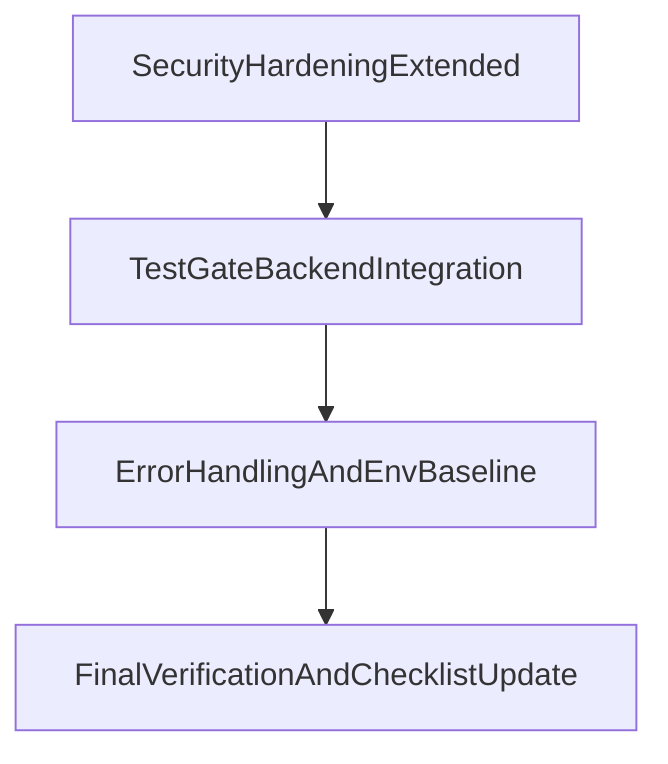

# Kế hoạch hiện thực 3 mục High Priority

## Mục tiêu

Triển khai 3 hạng mục theo thứ tự ưu tiên đã chốt trong `DEVELOPMENT_CHECKLIST.md`:

1. Security hardening (extended), 2) Test gate backend integration cho flow critical, 3) Error handling + production env baseline.

## 1) Security hardening (extended)

-   Thêm và cấu hình `helmet` tại backend app bootstrap.
-   Bổ sung rate limit theo nhóm route:
    -   Global baseline limiter cho toàn API.
    -   Auth limiter chặt hơn cho `/api/auth/*`.
    -   Optional stricter limiter cho endpoint nhạy cảm (login/register/forgot password nếu có).
-   Chuẩn hóa logging request/error có correlation id:
    -   Middleware tạo/propagate request id (`x-request-id`).
    -   Log request lifecycle (method, path, status, duration, requestId).
    -   Log error có requestId để truy vết.
-   File trọng tâm dự kiến:
    -   [backend/src/app.js](backend/src/app.js)
    -   [backend/package.json](backend/package.json)
    -   [backend/src/middlewares](backend/src/middlewares)
    -   [backend/src/utils](backend/src/utils)

## 2) Test gate backend integration cho critical flows

-   Thiết kế test matrix cho 4 flow bắt buộc:
    -   Auth (login/register/profile guard).
    -   Checkout/Order (create order, list/detail).
    -   Seller order update (quyền và cập nhật trạng thái).
    -   Notifications realtime/API contract mức backend (create/read/read-all/preferences).
-   Viết integration/API tests theo chuẩn test đang dùng trong repo (`node --test`) để tránh đổi stack test.
-   Đặt tiêu chí pass/fail rõ cho mỗi flow (status code, payload shape, state transition).
-   File trọng tâm dự kiến:
    -   [backend/test](backend/test)
    -   [backend/src/routes](backend/src/routes)
    -   [backend/src/services](backend/src/services)

## 3) Error handling + production env baseline

-   Chuẩn hóa error handler:
    -   Một middleware bắt lỗi tập trung trả response nhất quán (code/message/requestId).
    -   Map lỗi known (validation/auth/not-found) sang mã trạng thái phù hợp.
-   Chuẩn hóa env baseline production:
    -   Rà soát biến môi trường bắt buộc, thêm validate lúc startup (fail-fast khi thiếu config critical).
    -   Cập nhật `.env.example` cho backend với các biến mới cần thiết (rate-limit/logging/security).
-   Bổ sung tài liệu runbook ngắn cho local/prod config để team chạy thống nhất.
-   File trọng tâm dự kiến:
    -   [backend/src/app.js](backend/src/app.js)
    -   [backend/src/middlewares](backend/src/middlewares)
    -   [backend/src/config](backend/src/config)
    -   [backend/.env.example](backend/.env.example)

## Trình tự thực thi đề xuất

## Kiểm tra hoàn tất

-   Security: `helmet` + route-specific rate limit + request/error logging with requestId hoạt động.
-   Tests: bộ integration cho 4 flow critical chạy pass ổn định.
-   Error/env: startup fail-fast khi thiếu biến critical, format lỗi thống nhất và có requestId.
-   Cập nhật lại phần liên quan trong `DEVELOPMENT_CHECKLIST.md` sau khi code hoàn tất.
