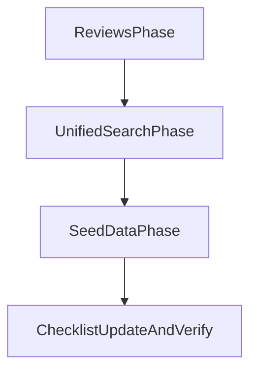

# Kế hoạch phase tiếp theo (iterative)

## Mục tiêu phase

Thực hiện tuần tự 3 mục MVP usability theo thứ tự đã chốt:

1. Reviews FE trên ProductDetail, 2) Unified Search v1, 3) Seed data QA/UAT.

## 1) Reviews FE trên ProductDetail (làm trước)

-   Mở rộng BE reviews list để hỗ trợ filter/sort tối thiểu.
-   Đồng bộ FE types + API mapper để hiển thị `sellerResponse` và `ratingDistribution` từ BE.
-   Bổ sung UI filter/sort trong trang product detail, render seller reply dưới review item.
-   File chính:
    -   [c:/Users/Admin/Documents/GitHub/SoCo-DATN/backend/src/validators/review.validator.js](c:/Users/Admin/Documents/GitHub/SoCo-DATN/backend/src/validators/review.validator.js)
    -   [c:/Users/Admin/Documents/GitHub/SoCo-DATN/backend/src/services/review.service.js](c:/Users/Admin/Documents/GitHub/SoCo-DATN/backend/src/services/review.service.js)
    -   [c:/Users/Admin/Documents/GitHub/SoCo-DATN/backend/src/controllers/review.controller.js](c:/Users/Admin/Documents/GitHub/SoCo-DATN/backend/src/controllers/review.controller.js)
    -   [c:/Users/Admin/Documents/GitHub/SoCo-DATN/frontend/src/features/product/types/product.types.ts](c:/Users/Admin/Documents/GitHub/SoCo-DATN/frontend/src/features/product/types/product.types.ts)
    -   [c:/Users/Admin/Documents/GitHub/SoCo-DATN/frontend/src/features/product/api/productApi.ts](c:/Users/Admin/Documents/GitHub/SoCo-DATN/frontend/src/features/product/api/productApi.ts)
    -   [c:/Users/Admin/Documents/GitHub/SoCo-DATN/frontend/src/features/product/hooks/useProductDetailPage.ts](c:/Users/Admin/Documents/GitHub/SoCo-DATN/frontend/src/features/product/hooks/useProductDetailPage.ts)
    -   [c:/Users/Admin/Documents/GitHub/SoCo-DATN/frontend/src/pages/ProductDetail.tsx](c:/Users/Admin/Documents/GitHub/SoCo-DATN/frontend/src/pages/ProductDetail.tsx)

## 2) Unified Search v1 (sau khi mục 1 pass)

-   Tạo endpoint tổng hợp `GET /api/search` fan-out products/users/posts với giới hạn kết quả mỗi type.
-   Thêm trang FE `/search?q=...` làm điểm vào thống nhất từ `UnifiedHeader`.
-   Chuẩn hóa DTO response search để FE render theo section/tab.
-   File chính:
    -   [c:/Users/Admin/Documents/GitHub/SoCo-DATN/backend/src/routes/index.js](c:/Users/Admin/Documents/GitHub/SoCo-DATN/backend/src/routes/index.js)
    -   [c:/Users/Admin/Documents/GitHub/SoCo-DATN/backend/src/routes/search.routes.js](c:/Users/Admin/Documents/GitHub/SoCo-DATN/backend/src/routes/search.routes.js)
    -   [c:/Users/Admin/Documents/GitHub/SoCo-DATN/backend/src/controllers/search.controller.js](c:/Users/Admin/Documents/GitHub/SoCo-DATN/backend/src/controllers/search.controller.js)
    -   [c:/Users/Admin/Documents/GitHub/SoCo-DATN/backend/src/services/search.service.js](c:/Users/Admin/Documents/GitHub/SoCo-DATN/backend/src/services/search.service.js)
    -   [c:/Users/Admin/Documents/GitHub/SoCo-DATN/frontend/src/shared/ui/organisms/unified-header/UnifiedHeader.tsx](c:/Users/Admin/Documents/GitHub/SoCo-DATN/frontend/src/shared/ui/organisms/unified-header/UnifiedHeader.tsx)
    -   [c:/Users/Admin/Documents/GitHub/SoCo-DATN/frontend/src/pages/Search.tsx](c:/Users/Admin/Documents/GitHub/SoCo-DATN/frontend/src/pages/Search.tsx)
    -   [c:/Users/Admin/Documents/GitHub/SoCo-DATN/frontend/src/features/search/api/searchApi.ts](c:/Users/Admin/Documents/GitHub/SoCo-DATN/frontend/src/features/search/api/searchApi.ts)
    -   [c:/Users/Admin/Documents/GitHub/SoCo-DATN/frontend/src/app/router](c:/Users/Admin/Documents/GitHub/SoCo-DATN/frontend/src/app/router)

## 3) Seed data QA/UAT (sau khi mục 2 pass)

-   Mở rộng seed từ admin-only sang bộ dữ liệu QA/UAT có quan hệ: categories, users, products, orders, orderItems, reviews.
-   Dùng chiến lược idempotent (upsert bằng khóa deterministic: email/slug/orderNumber).
-   Không xóa dữ liệu mặc định; reset chỉ qua cơ chế riêng.
-   File chính:
    -   [c:/Users/Admin/Documents/GitHub/SoCo-DATN/database/prisma/seed.js](c:/Users/Admin/Documents/GitHub/SoCo-DATN/database/prisma/seed.js)
    -   [c:/Users/Admin/Documents/GitHub/SoCo-DATN/database/prisma/schema.prisma](c:/Users/Admin/Documents/GitHub/SoCo-DATN/database/prisma/schema.prisma)
    -   [c:/Users/Admin/Documents/GitHub/SoCo-DATN/backend/.env.example](c:/Users/Admin/Documents/GitHub/SoCo-DATN/backend/.env.example)

## Luồng thực thi

## Kiểm chứng ở mỗi vòng

-   Sau mỗi mục: chạy test/lint phạm vi liên quan và rà regression tối thiểu.
-   Chỉ khi mục hiện tại đạt tiêu chí mới chuyển sang mục tiếp theo.
-   Cuối phase: cập nhật lại `DEVELOPMENT_CHECKLIST.md` theo trạng thái mới.
