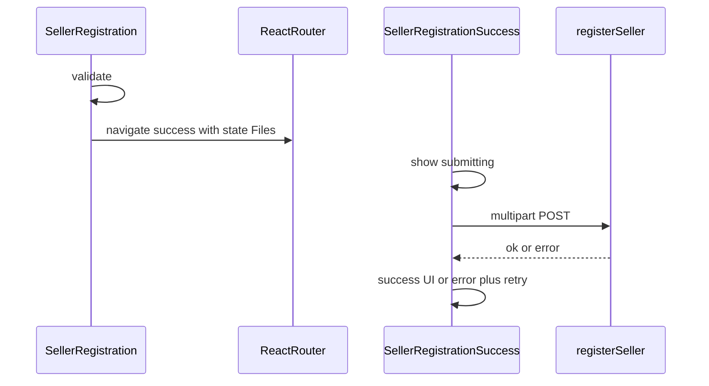

# UX: Submit seller application không chặn wizard

## Bối cảnh kỹ thuật

- API `[registerSeller](frontend/src/features/seller/api/sellerApi.ts)` là **một request multipart** (ảnh CCCD + optional logo/cover). Không thể “hoàn tất trên server thật sự trong nền” mà không đổi backend (queue, tách upload…).
- Cách đáp ứng yêu cầu **không bắt user chờ trên wizard**: điều hướng **ngay** sang `[SellerRegistrationSuccess.tsx](frontend/src/pages/SellerRegistrationSuccess.tsx)`, truyền dữ liệu qua `[location.state](https://reactrouter.com/en/main/hooks/use-location)` (giữ được tham chiếu `File` trong cùng phiên SPA). Trang success hiển thị trạng thái **Đang gửi hồ sơ…** rồi gọi `sellerApi.registerSeller` + `refreshProfile` khi xong.
- **Giới hạn**: F5 hoặc mở URL success trực tiếp sẽ **mất** `File` trong state — cần xử lý rõ (xem dưới).

## Thay đổi chính

### 1. Type cho `location.state`

- Thêm type (ví dụ trong `[frontend/src/features/seller/types/seller.types.ts](frontend/src/features/seller/types/seller.types.ts)` hoặc file nhỏ cạnh success page): `SellerRegistrationSuccessLocationState` gồm:
    - `submissionId: string` (UUID tạo ở wizard trước khi navigate)
    - `data`: gộp step1–3
    - `files`: `[SellerRegistrationWizardFiles](frontend/src/features/seller/api/sellerApi.ts)`
    - `applyShopBrandingToProfile: boolean`

### 2. `[SellerRegistration.tsx](frontend/src/pages/SellerRegistration.tsx)` — `handleSubmit`

- Giữ validation hiện tại (ID ảnh bắt buộc, v.v.).
- **Không** `await sellerApi.registerSeller` trên trang này.
- Tạo `submissionId = crypto.randomUUID()`, rồi `navigate("/seller-registration/success", { state: { ... }, replace: false })`.
- Có thể gọi `setIsSubmitting(false)` ngay sau `navigate` (hoặc bỏ spinner dài trên wizard — chỉ cần phản hồi tức thì nút submit).

### 3. `[SellerRegistrationSuccess.tsx](frontend/src/pages/SellerRegistrationSuccess.tsx)`

- Dùng `useLocation()`, `useNavigate()`, `useAuthSession().refreshProfile`.
- **Nếu có state pending** (đúng shape):
    - `useEffect` một lần theo `submissionId`: trước khi gọi API, kiểm tra **module-level `Set<string>`** đã xử lý `submissionId` chưa — tránh gửi trùng do [React Strict Mode](https://react.dev/reference/react/StrictMode) gọi effect hai lần.
    - UI theo phase: `submitting` (Loader + copy tiếng Việt phù hợp phần còn lại của app) → `success` (nội dung hiện tại của trang) → `error` (dùng cùng logic `[messageForSellerRegistrationSubmitError](frontend/src/pages/SellerRegistration.tsx)` — nên **extract** hàm này ra module dùng chung, ví dụ `sellerRegistrationErrors.ts`, để success page import được).
    - Sau success: `await refreshProfile()`, rồi `navigate("/seller-registration/success", { replace: true, state: {} })` hoặc flag local để chỉ hiển thị UI success (tránh re-submit khi bấm Back). Ưu tiên `replace: true` + xóa pending state.
- **Nút lỗi**: Thử lại (gọi lại API với cùng state nếu còn), hoặc `Link` về `/become-seller` để điền lại form.
- **Không có state** (vào trực tiếp / refresh):
    - Gọi `sellerApi.getApplicationStatus()`: nếu `REVIEWING` hoặc đã seller → hiển thị **thành công** (đơn đã nộp).
    - Ngược lại → copy kiểu “Chưa có đơn từ phiên này” + nút về `[/become-seller](frontend/src/app/router/auth.routes.tsx)` (tránh hiển thị “Application Submitted” sai).

### 4. Extract helper lỗi

- Di chuyển `messageForSellerRegistrationSubmitError` ra file dùng chung (import `HttpError` từ `[httpClient](frontend/src/shared/api/httpClient.ts)`), dùng ở cả wizard (nếu còn chỗ báo lỗi) và success page.

## Không nằm trong scope (trừ khi bạn muốn mở rộng sau)

- Pattern tương tự cho **mọi** nút chậm toàn app (toast global, queue job thật trên server, v.v.).
- Lưu `File` vào IndexedDB để survive refresh — phức tạp hơn nhiều.

## Rủi ro đã kiểm soát

| Rủi ro                    | Cách xử lý                                                                              |
| ------------------------- | --------------------------------------------------------------------------------------- |
| Double POST (Strict Mode) | `Set` theo `submissionId` ở module scope                                                |
| User refresh khi đang gửi | Mất state; hướng dẫn quay lại form + kiểm tra trạng thái đơn qua `getApplicationStatus` |
| Back sau lỗi              | State còn → có thể Retry; sau success dùng `replace` + clear state                      |

