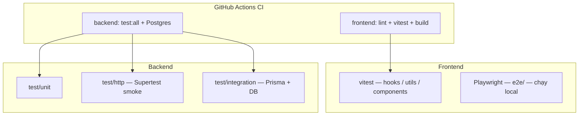

# Hệ thống kiểm thử SoCo-DATN

Tài liệu tổng quan cho kiểm thử **frontend** (React/Vite) và **backend** (Express API). Chi tiết từng package nằm trong:

| Package   | Tài liệu chi tiết        |
| --------- | ------------------------ |
| Frontend  | [frontend/TEST.md](frontend/TEST.md) |
| Backend   | [backend/TEST.md](backend/TEST.md)   |

## Kiến trúc tổng quan



| Lớp | Công cụ | Cần DB / server thật? | Chạy trong CI? |
| --- | ------- | --------------------- | -------------- |
| Frontend unit | Vitest + jsdom + Testing Library | Không | Có |
| Frontend E2E | Playwright (Edge) | Dev server Vite + mock API | Không (local) |
| Backend unit | Vitest (Node) | Không (`SKIP_DB_CONNECT`) | Có |
| Backend HTTP smoke | Vitest + Supertest | Không (app in-memory) | Có |
| Backend integration | Vitest + Supertest + Prisma | Có (`DATABASE_URL`) | Có (Postgres service) |

## Chạy nhanh (từ thư mục gốc repo)

```bash
# Frontend — unit (51 file, ~185 test)
cd frontend && npm ci && npm test

# Backend — unit + HTTP smoke (14 file, ~118 test)
cd backend && npm ci && npm test

# Backend — thêm integration (cần PostgreSQL + migrate)
cd backend
# Đặt DATABASE_URL trong .env, rồi:
npm run prisma:migrate:deploy   # hoặc quy trình team
npm run test:all                # test + test:integration

# Frontend — E2E (cần Microsoft Edge, Playwright browsers)
cd frontend && npx playwright install msedge
npm run test:e2e
```

## Kết quả chạy gần đây (máy dev)

| Lệnh | Kết quả | Ghi chú |
| ---- | ------- | ------- |
| `frontend`: `npm test` | **51 file / 185 test passed** | ~58s |
| `backend`: `npm test` | **14 file / 118 test passed** | ~99s (setup app lần đầu chậm) |
| `backend`: `npm run test:integration` | **9 test skipped** | Không có `DATABASE_URL` trên máy → skip theo thiết kế |

Khi integration bị skip, đó **không phải lỗi** — xem [backend/TEST.md](backend/TEST.md#chạy-integration-trên-máy-local).

## CI (`.github/workflows/ci.yml`)

- **Frontend job**: `npm ci` → `npm run lint` (TypeScript) → `npm test` → `npm run build`.
- **Backend job**: Postgres 16 → Prisma validate/generate/migrate → seed → `npm run test:all` với `DATABASE_URL` và `JWT_SECRET` cố định cho CI.

E2E Playwright **chưa** nằm trong pipeline CI; chạy thủ công trước release hoặc khi đổi luồng UI lớn.

## Thêm test / sửa lỗi

1. Chạy đúng lệnh trong package (`frontend` hoặc `backend`).
2. Đọc tài liệu chi tiết của package (bảng ở đầu file).
3. **Backend integration**: luôn set `DATABASE_URL` và migrate trước khi kết luận “test fail”.
4. **Frontend E2E**: đảm bảo port 3000 trống; Playwright tự `npm run dev` (không reuse server cũ).

## Cấu trúc thư mục test (tóm tắt)

```
SoCo-DATN/
├── TESTING.md              ← file này
├── frontend/
│   ├── TEST.md
│   ├── vitest.config.ts
│   ├── e2e/                ← Playwright
│   └── src/**/__tests__/   ← Vitest (colocated)
└── backend/
    ├── TEST.md
    ├── vitest.config.js
    ├── vitest.integration.config.js
    └── test/
        ├── unit/
        ├── http/
        ├── integration/
        ├── helpers/
        └── setup/
```
