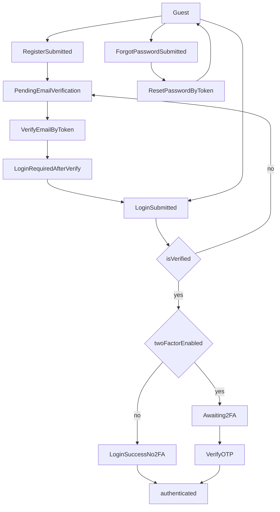

# Auth UI Specification (Backend-aligned)

This document finalizes the UI flow for:

- Registration
- Login
- 2FA verification
- Email verification
- Forgot password
- Reset password

Backend sources of truth:

- `backend/src/routes/auth.routes.js`
- `backend/src/controllers/auth.controller.js`
- `backend/src/services/auth.service.js`
- `backend/src/validators/auth.validator.js`
- `backend/src/services/email.service.js`
- `backend/src/middlewares/error.middleware.js`

## 1) Auth State Machine




Recommended frontend auth states:

- `guest`
- `pending-email-verification`
- `awaiting-2fa`
- `authenticated`

## 2) API Base and Transport Rules

- API base: `/api/auth`
- All auth requests should use `credentials: include` so backend can set/read the `token` cookie.
- Backend accepts JWT from:
  - Header `Authorization: Bearer <token>`, or
  - Cookie `token` (httpOnly)

## 3) Form Specs per Screen

## 3.1 Register Screen

Endpoint: `POST /api/auth/register`

Form fields:

- `email` (required, valid email)
- `username` (required, 3-50 chars, regex `^[a-zA-Z0-9_]+$`)
- `password` (required, min 8 chars, must include uppercase + lowercase + number)
- `fullName` (required, non-empty, max 100 chars)
- `phone` (optional, 10-15 digits)

Success UX:

- Show a registration success message
- Route to "check your email for verification" page/state (`pending-email-verification`)

Known errors:

- `400` validation failed
- `409` duplicate email/username

## 3.2 Verify Email Screen

Endpoint: `POST /api/auth/verify-email`

Input source:

- Read `token` from query string: `/verify-email?token=...`

Payload:

- `token` (required)

Success UX:

- Mark email as verified
- Redirect to `/login` and require the user to log in again
- Even if backend returns/sets token, frontend should not treat this step as authenticated

Related action:

- `POST /api/auth/resend-verification`
- Payload: `email` (required, valid email)

Known errors:

- `400` invalid/expired token or account already verified

## 3.3 Login Screen

Endpoint: `POST /api/auth/login`

Form fields:

- `email` (required; backend accepts email or username)
- `password` (required)

Success branch A (2FA disabled):

- Response returns `data.user`, `data.token`
- Backend sets `token` cookie
- Frontend sets auth state to `authenticated`

Success branch B (2FA enabled):

- Response returns `data.requires2FA = true`, `data.tempToken`
- Frontend routes to OTP screen and sets state `awaiting-2fa`

Error branch C (email not verified):

- Backend returns `403` with message `Please verify your email before logging in`
- Frontend should route user to email verification flow (`pending-email-verification`)
- Show CTA "Resend verification email" using `POST /api/auth/resend-verification`

Known errors:

- `401` invalid credentials
- `403` unverified email (return to verify flow) or deactivated account

## 3.4 2FA OTP Screen (Login Step 2)

Endpoint: `POST /api/auth/verify-2fa`

Form fields:

- `tempToken` (required, hidden field or state value)
- `otpCode` (required, 6 digits)

Success UX:

- Response returns `data.user`, `data.token`
- Backend sets `token` cookie
- Frontend sets auth state to `authenticated`

Known errors:

- `401` invalid/expired OTP
- `400` invalid/expired token, token purpose mismatch, or 2FA not enabled

Session handling note:

- `tempToken` is a temporary token for OTP verification only and must not be used for protected API access.

## 3.5 Forgot Password Screen

Endpoint: `POST /api/auth/forgot-password`

Form fields:

- `email` (required, valid email)

Security behavior (important for UI copy):

- Backend always returns a generic success message (to prevent email enumeration)
- UI should display the same success message for all outcomes

Recommended success copy:

- "If this email is registered, we have sent a password reset link."

## 3.6 Reset Password Screen

Endpoint: `POST /api/auth/reset-password`

Input source:

- Read `token` from query string `/reset-password?token=...`

Form fields:

- `token` (required)
- `newPassword` (required, min 8 chars, uppercase+lowercase+number)
- `confirmPassword` (required, must match `newPassword`)

Success UX:

- Show password reset success message
- Redirect to `/login`

Known errors:

- `400` invalid/expired reset token
- `400` weak password or password confirmation mismatch

## 4) Response Contract for Frontend

Validation error format:

```json
{
  "success": false,
  "message": "Validation failed",
  "errors": [
    { "field": "email", "message": "Please provide a valid email" }
  ]
}
```

Business error format:

```json
{
  "success": false,
  "message": "Invalid email or password"
}
```

Success format (common):

```json
{
  "success": true,
  "message": "Optional message",
  "data": {}
}
```

## 5) UI Validation Mapping (Frontend Rule Names)

Recommended frontend schema field names must match backend exactly:

- Register: `email`, `username`, `password`, `fullName`, `phone`, `role`
- Login: `email`, `password`
- Verify2FA: `tempToken`, `otpCode`
- VerifyEmail: `token`
- ForgotPassword: `email`
- ResetPassword: `token`, `newPassword`, `confirmPassword`

Rule summary:

- Email: valid RFC email format
- Username: 3-50 chars, `[a-zA-Z0-9_]`
- Password: min 8 chars, at least uppercase + lowercase + digit
- OTP: exactly 6 numeric chars
- Phone: 10-15 numeric chars

## 6) Wireframe-level UX Spec (No Code)

Register:

- Inputs: fullName, email, username, password, optional phone, optional role
- Primary CTA: "Sign up"
- Secondary link: "Already have an account? Log in"
- Success: move to verification instruction page/state

Verify Email:

- Auto-read token from URL
- CTA: "Verify now" (or auto-submit and display result)
- Secondary action: "Resend verification email"
- On success: show "Email verified successfully" then navigate to Login

Login:

- Inputs: email/username, password
- Primary CTA: "Log in"
- Secondary links: "Forgot password", "Sign up"
- If `requires2FA=true`: route to OTP screen
- If `403` + verify-email message: route to Verify Email flow

2FA OTP:

- Input: 6-digit OTP
- Hidden/state value: tempToken
- Primary CTA: "Verify"
- Helper text: "OTP has been sent to your email"

Forgot Password:

- Input: email
- Primary CTA: "Send reset link"
- Success state: always show generic success message

Reset Password:

- Inputs: newPassword, confirmPassword
- Token from URL query
- Primary CTA: "Reset password"
- Success: show success message and return to login

## 7) Implementation-ready Checklist

Frontend routes:

- `/register`
- `/login`
- `/verify-email`
- `/verify-2fa`
- `/forgot-password`
- `/reset-password`

Implementation rules:

- Create auth service methods with backend-exact payload names
- All auth fetch calls use `credentials: "include"`
- Prioritize mapping `errors[]` to field-level errors; fallback to top-level `message`

State transitions to test:

- Register -> Pending verify
- Verify success -> Login required
- Login (unverified) -> Pending verify
- Login (2FA off) -> Authenticated
- Login (2FA on) -> Awaiting2FA -> Authenticated
- Forgot -> Reset -> Login

